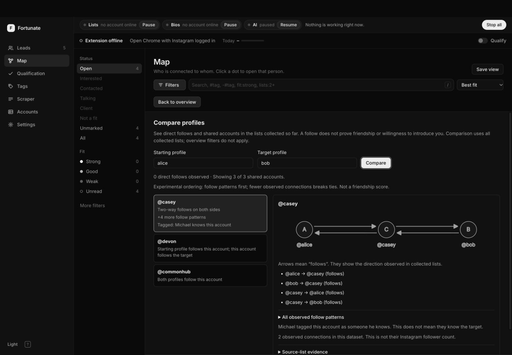

# Comparing Instagram connections

Open **Map → Compare profiles**, enter two handles already in the collected data, then select an intermediary. The view shows directed follow patterns, source-list evidence and collection coverage. It reads the entire collected pair neighborhood independently of the overview's lead filters and node cap. It does not collect new data.

## Preview

Fictional profiles on the real local application. Desktop and 390px mobile layouts were checked for overflow and keyboard access.



[Mobile evidence view](ui/connection-comparison-mobile.png)

## API

`GET /api/connections?source=alice&target=bob&limit=20`

Handles may have a leading `@` and are case-insensitive. The result limit is an integer from 1 to 100, default 20. Missing, invalid, unknown, ambiguous or parked handles and comparisons of the same canonical account return 400. Local host/origin protections are inherited from the application.

Response:

- `source`, `target`: `{id, handle, name, person_id, identity_basis}`. IDs prefer `ig:<Instagram ID>`; provisional nodes use `person:<local ID>` or `seed:<handle>`.
- `direct_relationships`: observed follows between the endpoints, deduplicated by directed canonical account pair.
- `connectors`: `{node, motifs, links, manual_known, rank}`. Multiple motifs can apply. `manual_known` requires an explicit manual `Already know them` tag on a safely resolved member of that account identity; workflow statuses do not qualify.
- `graph`: `{nodes, links}` for endpoints and returned intermediaries.
- `coverage`: `{seed, direction, state, received, total, status, updated_at}` for endpoints, displayed intermediaries and their supporting source lists. `status` is `uncollected`, `partial`, `reported_complete` or `count_mismatch`.
- `total_candidates`, `returned_count`, `truncated`: counts before and after the display limit.
- `ranking`, `limitations`: the method and interpretation limits.

Each link is `{source, target, evidence}`. Evidence contains `seed`, `direction`, `first_observed`, `timestamp_status`, `freshness`, `observation_count`, `last_observed`, `last_job_id` and `last_page_key`. Missing legacy timestamps remain null. Malformed, timezone-free and future timestamps are not used as valid observation dates. A last-observed date describes the last accepted page containing this account, not proof that the follow is active now.

Motifs:

| Value | Directed pattern for endpoints A/B and intermediary X |
| --- | --- |
| `reciprocal_support` | A ↔ X ↔ B |
| `directed_path` | A → X → B |
| `reverse_path` | B → X → A |
| `shared_follower` | A ← X → B |
| `shared_followee` | A → X ← B |

Experimental order: reciprocal tier 3, either directed path tier 2, overlap tier 1. Within a tier, lower observed unique-neighbor degree comes first, then handle and ID for deterministic ties. `hub_penalty = 1/log2(2+observed_degree)` and `heuristic_score = tier+hub_penalty`; these are not probabilities or measures of friendship. Degree counts distinct neighbors in the stored dataset, not public follower totals. Results share one SQLite read snapshot, including concurrent-collection cases.

## Durable observation tables

The existing four-column `edges` table remains compatible. `db.init` adds:

```sql
edge_observations(
  seed TEXT COLLATE NOCASE, person_id INT, direction TEXT,
  page_key TEXT, job_id INT, observed_at TEXT,
  PRIMARY KEY(seed, person_id, direction, page_key)
)
ingested_list_pages(
  page_key TEXT PRIMARY KEY, seed TEXT COLLATE NOCASE,
  direction TEXT, observed_at TEXT
)
```

Managed page identity uses job ID plus the returned cursor, matching existing page idempotency. Unknown/mismatched jobs are refused. Terminal-job or repeated pages return `duplicate: true` before changing people, lists, edges or observation dates. Old clients may omit a job ID; those imports use a digest of source, direction, cursor and distinct member identities. Identical unmanaged batches cannot establish fresh re-observation. A genuine recheck needs a new managed job. Transaction rollback covers the page and all its derived writes.

Known seed IDs cannot silently change through list ingestion, profile ingestion or legacy import. A conflict is refused before writes; preserving history is preferable to guessing which account owns it. Query-time alias resolution can reconcile known stable IDs but does not repair historical identity mistakes already present in a database. Correct those with verified source evidence.

Person merges retain distinct observation records and the earliest edge observation. Schema migration does not invent observations for legacy edges. Partial refreshes retain historical edges. `received` still means accumulated distinct members across imports, not a fresh-run count. This release does not infer unfollows, introduce run-completeness guarantees or migrate the global qualification formula.

## Source-tag change

Auto tags now say `Instagram link` for observed follows involving the owner and `mentions you` for a bio mention. A bio mention does not add an owner follow. The tag version changes to `t3-observed-links`, which triggers the existing background re-derivation. Manual relationship tags remain owner input. Saved filters referencing the old auto `knows you` tag should be updated to `Instagram link`; both old and new names refer to Instagram evidence, not personal familiarity.

## Validation

```sh
python3 -m unittest discover -s server/tests
node --test tests/connections-ui.test.mjs extension/test/*.test.mjs
node tests/e2e/driver.mjs --verbose
python3 tests/bench_connections.py --people 100000 --runs 3
```

Tests cover directed evidence, duplicate sources, aliases and conflicting IDs, partial coverage, legacy and invalid dates, result caps, hub ordering, manual provenance, concurrent reads, replayed pages, atomic rollback, UI request races and safe rendering. Benchmark data is synthetic and lives in a temporary database. Browser verification also uses fictional profiles.

Verified on 26 September 2026:

- Server suite: 172 tests, no failures; one optional live-LLM test skipped. Run with `FL_NO_ORSLOT=1` to avoid external key-slot lookups.
- Browser-independent UI and extension suite: 48 passed.
- Collection simulation: 83 checks passed over eight simulated hours, 509 pages, 12,801 people and 14,969 unique edges. Worker restarts, response loss, a four-minute server outage, cooldowns and resume produced no duplicate edges or unacknowledged results. This runs the extension worker in a simulated environment against local test servers, not live Instagram or a real Chrome extension session.
- Browser inspection: desktop and 390px mobile, keyboard submission/selection, expanded direction evidence and no horizontal overflow or console errors.
- Synthetic 100,000-person benchmark, three runs per case: typical comparison median 41 ms; high-degree comparison median 222 ms with legacy edges and 263 ms with tracked observations. These are local measurements, not production latency guarantees or ranking-quality evaluation.

The test run also exposed a small existing Laya health-cache startup bug: an uninitialized timestamp of zero could be treated as a cached failure during the first minute of process uptime. The cache now requires an initialized timestamp, with a regression test.

Research, alternatives, the adversarial check and next-stage snapshot/outcome design are in [CONNECTION_MAPPING_RESEARCH.md](CONNECTION_MAPPING_RESEARCH.md).
