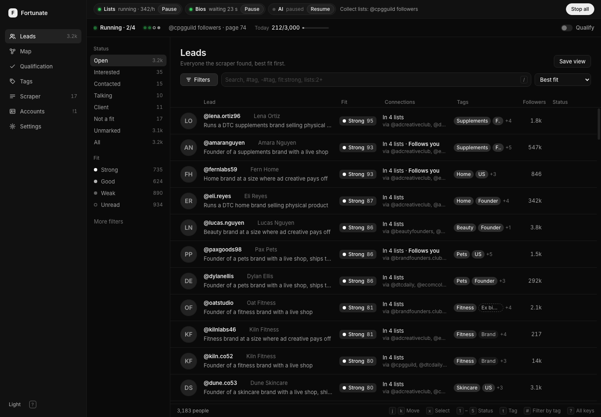
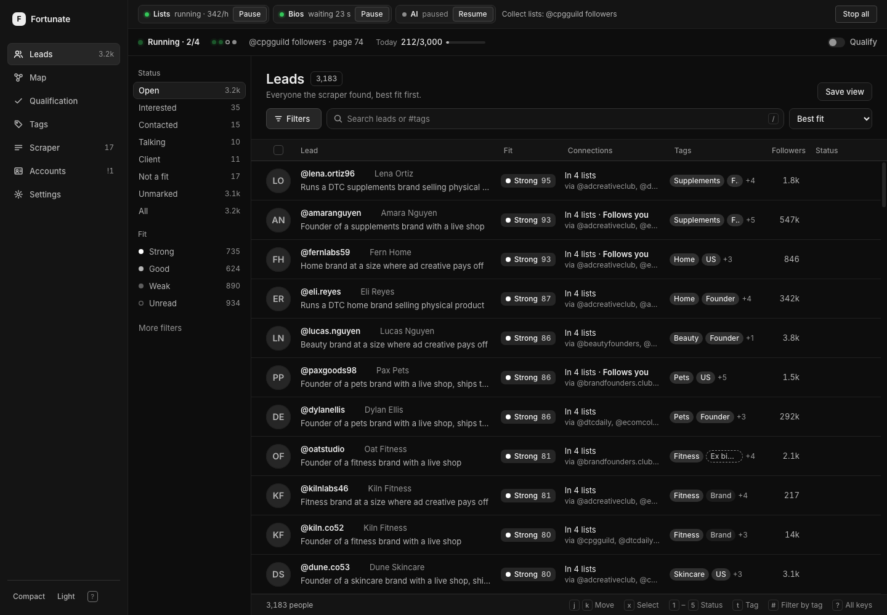

# Fortunate Leads UI polish

Current update, 27 September 2026: bulk selection/editing, saved views and in-app CSV exports have been removed. Individual relationship, tag and note edits remain. Existing saved-view data and workspace backups are preserved. References to those removed features below describe the earlier implementation. See [CONTRACT.md](CONTRACT.md) for current APIs.

Research and implementation, 26 September 2026.

## Decision

Keep the current monochrome workspace, Inter typography, navigation, filter rail, compact lead list and adjacent detail panel. Improve reading, selection, orientation and control feedback within that structure. The existing screen already has enough information and controls; adding summary dashboards or larger cards would take space away from leads.

This is an incremental polish. It changes no scraping limits, ranking, qualification, API contracts or stored lead data. Production changes use the existing HTML, CSS and JavaScript with no new dependencies.

## What we researched

The research used current primary product documentation and accessibility guidance. Product documentation establishes how these systems work; it does not prove that copying their appearance will improve Fortunate. The recommendations below are our application of those patterns to this app.

| Reference | Evidence | Application to Fortunate |
| --- | --- | --- |
| [Linear UI refresh, March 2026](https://linear.app/changelog/2026-03-12-ui-refresh) and [design rationale](https://linear.app/now/behind-the-latest-design-refresh) | Linear describes standardized headers, navigation and view controls, while retaining familiarity and information density. | Keep the shell and row sizes. Give controls a consistent height and selected states, and make the main working area easier to read. |
| [Attio table views](https://attio.com/help/reference/managing-your-data/views/create-and-manage-table-views) and [filtering](https://attio.com/help/reference/managing-your-data/views/filter-and-sort-views) | Table tools sit near records; filtering, sorting and saved views are distinct operations. | Keep search, sorting and filters together. Add an explicit Clear control when filters are active, with a visible result count on mobile as well as desktop. |
| [Attio record pages](https://attio.com/help/academy/introduction/record-pages) | Identity, highlights and detailed information have separate roles on a record page. | Keep identity and close control visible when scrolling the existing detail panel; improve section labels without adding new content. |
| [Folk contact profiles](https://help.folk.app/en/articles/5007276-contact-profile) and [views](https://help.folk.app/en/articles/4998224-create-views) | Contact profiles can open beside a list, and views retain filters, sorting and column choices. | Preserve contextual detail viewing and existing saved views. Opening and closing details by keyboard should return focus to the same lead. |
| [Clay table columns](https://university.clay.com/docs/table-columns-overview) | Detailed cell information can be inspected in a side panel; columns can be hidden. | Preserve the existing responsive column hierarchy and handle-first rows. Long supporting information belongs in detail, not extra lines in every row. |
| [Carbon data tables](https://carbondesignsystem.com/components/data-table/usage/) | Table density and available width affect scanning; table tools and batch actions have distinct roles. | Preserve 64px comfortable and 48px compact rows. Align the header and rows, make selection visible, and retain current batch actions. |
| [W3C text contrast](https://www.w3.org/WAI/WCAG22/Understanding/contrast-minimum.html) | Ordinary text needs at least 4.5:1 contrast at AA; placeholder text is included. | Increase secondary and placeholder contrast in both themes. Use weight and spacing to retain hierarchy. |
| [W3C focus visibility](https://www.w3.org/WAI/WCAG22/Understanding/focus-visible.html) and [reduced motion](https://www.w3.org/WAI/WCAG22/Techniques/css/C39) | Keyboard focus must be visible. Reduced-motion preferences can suppress nonessential interaction animation. | Stronger neutral focus rings, keyboard-operable lead buttons, stable focus after updates, and a reduced-motion rule. |

The useful current direction is consistency and less visual distraction in dense tools. We found no evidence requiring a new accent color, font, navigation model, glass effects or decorative animation. Those would change the app's identity without addressing an observed problem.

## Audit of the current app

The archived screenshots in `docs/ui/` predate the source on `main`: they show colored badges, an earlier column order and navigation without Qualification. We captured the current source before judging it. Images in `docs/ui/polish/` supersede those older images for this change.

| Observed issue | Implemented polish |
| --- | --- |
| Metadata and search guidance were difficult to read, especially in light mode. | Updated neutral text and focus tokens; the light theme retains its dark navigation. |
| Search syntax dominated the placeholder, controls had mismatched heights, and phone users had no visible result count. | Short search hint with syntax retained in the tooltip, search icon, aligned controls, count beside the title and a conditional Clear button. |
| The list header's selection control was effectively hidden; individual selection depended on hover. | Always-visible header checkbox, keyboard reveal, visible touch selection and larger checkbox hit area. |
| Current, selected and open rows were too similar. | More deliberate background and edge treatments, preserving the fixed row geometry. |
| Lead rows lacked a native keyboard opening control, and updates replaced focused controls. | Native lead buttons, labeled selection state, focus restoration by lead identity and predictable return from details. |
| Long detail scrolling lost identity and the close action. | Sticky identity header and clearer section labels, preserving section order. |
| Phone navigation hid the visible labels without independent accessible names. | Named navigation links, current-page state, named search controls and a skip link that preserves the current route. |
| Stage controls were visually crowded and ambiguous to keyboard users. | Consistent stage controls, explicit accessible names and a compact phone arrangement. |
| Empty results provided little guidance. | Short, contextual guidance with the existing recovery action. |
| Pulsing indicators ignored reduced motion. | Suppress nonessential CSS animation and transitions when requested. |

## Scope guard

The strongest counterargument is that this workspace already has a lot of chrome. Extra hierarchy can become extra clutter. The implementation therefore preserves row heights, the existing panes, the handle-first identity and familiar action locations. The title count replaces information that was inaccessible on phones; it is not an additional dashboard. The detail header uses the existing content.

The mock preview had fallen behind the app: stage controls reported offline and Qualification returned no data. The preview now implements those existing response shapes and in-memory actions so all seven screens can be reviewed without a live account. This is development sample data, not a new production feature or a substitute for a live collection soak.

## Verification

See [the repeatable UI checks](../tests/ui/README.md). The visual and interaction checks cover both themes, all seven pages, phone and desktop widths, detail panels at intermediate widths, search and clearing, pausing and resuming Lists while Bios continues, keyboard activation, selection, focus return, density, virtual scrolling and reduced motion.

Screenshots use the deterministic sample dataset. The before image uses the original production UI with the updated preview fixtures, so the comparison does not confuse a missing mock endpoint with a UI improvement. The review does not certify full WCAG compliance or live Instagram collection behavior.

Verified on 26 September 2026:

- 138 browser assertions passed. All seven pages were captured at 1440px and 390px in both themes. Detail and filter checks also covered 1280px, 1024px and 768px. [Recorded results](ui/polish/checks.json).
- 11 further checks passed against the actual production handlers with a temporary, seeded database and background workers disabled. These included opening every page, loading a lead and saving then reading back a note.
- The existing server suite completed on Python 3.11.15: 132 tests run, 131 passed and one skipped. The extension suite passed all 42 tests.
- JavaScript syntax and patch whitespace checks passed. Source review identified two keyboard bugs during this work, both fixed and covered by the final browser run.
- Secondary and placeholder text tokens measured at least 4.56:1 against the lowest-contrast tested dark surface and at least 4.73:1 against the darkest light surface. This token check does not measure every rendered element or certify the whole application.

The initial server run on this Mac's Python 3.9 failed two unchanged Laya health tests. Its monotonic clock starts near zero, which interacts with the preexisting initial cache timestamp. The same tests and full suite pass on Python 3.11; server code was not changed in this UI PR.

## Visual comparison

| Before | After |
| --- | --- |
|  |  |

Further examples: [phone leads](ui/polish/leads-dark-390.png), [lead details](ui/polish/detail-dark-1440.png), [light theme](ui/polish/leads-light-1440.png), [map](ui/polish/map-dark-1440.png), [qualification](ui/polish/qualification-dark-1440.png), [phone settings](ui/polish/settings-light-390.png) and [phone tags](ui/polish/tags-dark-390.png).
